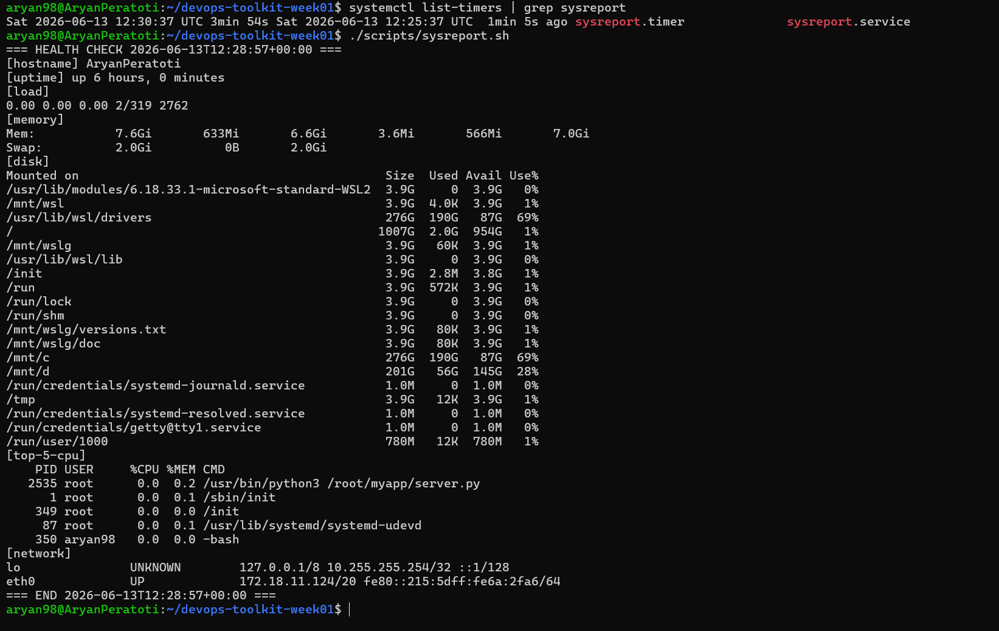
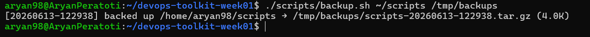
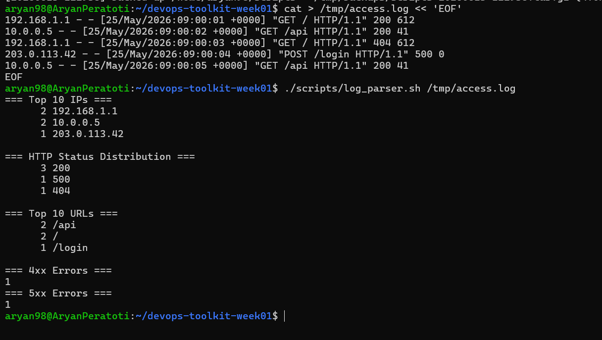
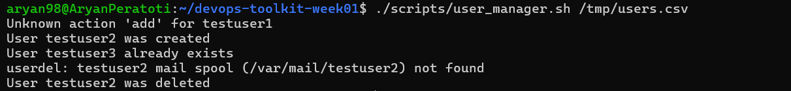
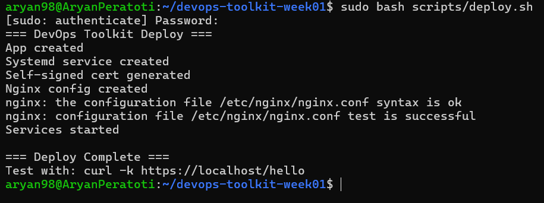
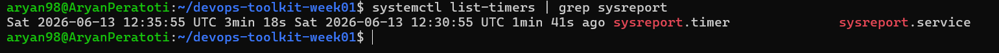

# Demo Outputs

## sysreport.sh
Run: `./scripts/sysreport.sh`

## backup.sh
Run: `./scripts/backup.sh ~/scripts /tmp/backups`

## log_parser.sh
Run: `./scripts/log_parser.sh /tmp/access.log`

## user_manager.sh
Run: `./scripts/user_manager.sh /tmp/users.csv`

## deploy.sh + HTTPS Test
Run: `sudo bash scripts/deploy.sh`

## HTTPS Test
Run: `curl -k https://localhost/hello`

## systemd Timer
Run: `systemctl list-timers | grep sysreport`
# Demo Outputs

